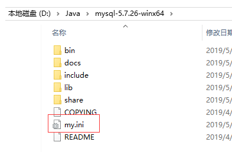
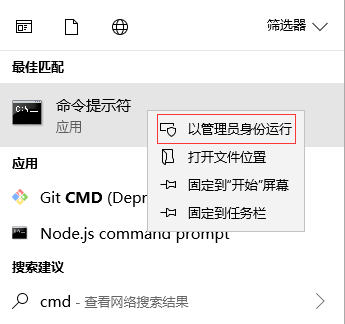
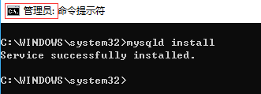
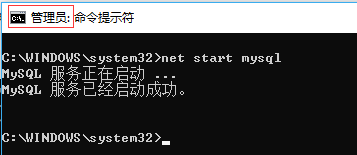
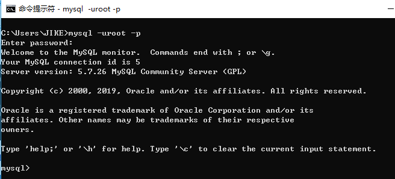
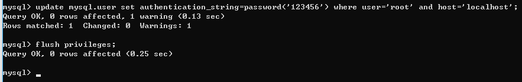
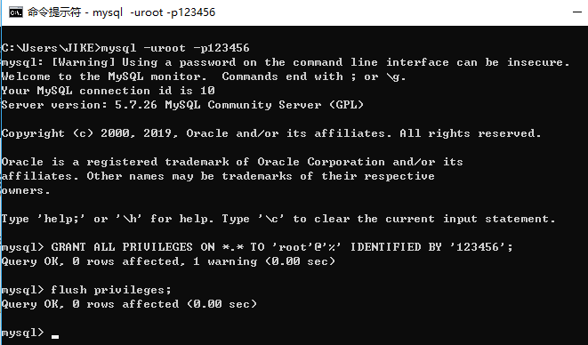
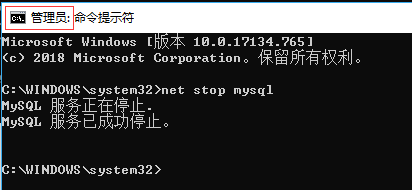
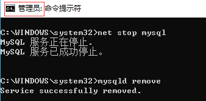

# mysql安装

# 0. 下载

https://dev.mysql.com/downloads/mysql/

http://c.biancheng.net/view/2391.html

PS：不要下载8.0+以上的版本，容易出错

## 1.解压

将 mysql-8.0.21-winx64.zip 解压并移动到C:\Program Files\Java\ 目录


## 2.配置

在C:\Program Files\Java\mysql-8.0.21-winx64 目录新建 my.ini文件，复制以下内容到该文件

```properties
[mysql]  
#设置mysql客户端默认字符集  
default-character-set=utf8  
[mysqld]  
#设置3306端口  
port = 3306  
# 设置mysql的安装目录  
basedir=C:\Program Files\Java\mysql-5.7.29-winx64
# 设置mysql数据库的数据的存放目录  
datadir=C:\Program Files\Java\mysql-5.7.29-winx64\sqldata
# 允许最大连接数  
max_connections=200  
# 服务端使用的字符集默认为8比特编码的latin1字符集  
character-set-server=utf8  
# 创建新表时将使用的默认存储引擎  
default-storage-engine=INNODB
```

 

## 3.配置环境变量


## 4.安装mysql服务

以管理员身份运行cmd命令：

 

   

C:\WINDOWS\system32\cmd.exe

```bash
C:\WINDOWS\system32>mysqld install
```

## 5.初始化mysql数据库

```bash
mysqld  --initialize-insecure --user=mysql
```

 

## 6.启动mysql服务

需要以管理员身份运行

```shell
net start mysql
```

   

## 7.登录mysql数据库

```shell
mysql -uroot -p
```

 

> 可以不使用管理员身份运行
>
> root 帐号是mysql数据库的超级管理员，拥有最高权限
>
> root帐号的默认密码为空

## 8.设置root帐号密码

- 8.0+版本

```mysql
ALTER USER 'root'@'localhost' IDENTIFIED BY '你的密码' PASSWORD EXPIRE NEVER; # 修改加密规则 
ALTER USER 'root'@'localhost' IDENTIFIED WITH mysql_native_password BY '你的密码'; # 更新一下用户的密码 
FLUSH PRIVILEGES; #刷新权限
```

```
说明：8+ 版本使用的密码加密规则为 caching_sha2_password
navicate 驱动目前不支持新加密规则，解决问题方法有两种，一种是升级 navicat 驱动，一种是把 mysql 用户登录密码加密规则还原成 mysql_native_password，这里我们将 mysql 规则修改回之前的 mysql_native_password，
```

- 8.0版本以下

update mysql.user set authentication_string=password('123456') where user='root' and host='localhost';

flush privileges;

```
说明：mysql.user  mysql是数据库名称，该数据库是mysql系统使用的数据库  user是mysql库下的表名称
password('123456') password是mysql的加密函数 返回加密后的密文字符串
```




## 10.允许root帐号远程访问

```sql
GRANT ALL PRIVILEGES ON *.* TO 'root'@'%' IDENTIFIED BY '123456';
flush privileges;
```

 

> % 表示任意主机都可以以 帐号root 密码123456 登录访问mysql数据库

## 11.停止mysql服务

需要以管理员身份运行

```shell
net stop mysql
```

 

## 12.删除mysql服务

需要以管理员身份运行

 